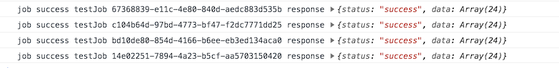

# React Native Queue Processor Sample Application

Sample app that uses all of the commonly used [rn-background-queue-processor](https://github.com/technogise/rn-background-queue-processor) features along with [rn-background-queue-processor-realm-adapter](https://github.com/technogise/rn-background-queue-processor-realm-adapter)

## Setup

 - run `npm install`
 - use command `npx react-native run-android` to run on android device
 
## Usage

- [ExampleJob.js](app/service/ExampleJob.js):
      
  The `ExampleJob` class is developer defined class which extends Job and has user defined `execute`, `jobSuccess` and `jobFail`.
  
```
  export default class ExampleJob extends Job {
    execute(
      successCallback = data => {
        this.jobSuccess(data);
      },
      failCallback = data => {
        this.jobFail(data);
      },
    ) {
      const {url} = this.job.param;
      fetch(url)
        .then(response => {
          return response.json();
        })
        .then(data => {
          successCallback(data);
        })
        .catch(error => {
          failCallback(error);
        });
    }
  
    jobSuccess(data) {
      console.log('job success', this.job.name, this.job.id, 'response', data);
    }
  
    jobFail(data) {
      console.log('job Fail', this.job.name, this.job.id, data, 'response', data);
    }
  }
  
```
      
- [MainScreen.js](app/screens/MainScreen.js):

  - To add a job in the queue
    
```
  onAdd() {
    const jobToBeCreated = {
      name: 'testJob',
      param: {
        url: 'http://dummy.restapiexample.com/api/v1/employees',
      },
    };
    const job = new ExampleJob(jobToBeCreated);
    this.queue.enqueue(job);
  }
```
  - To add the queue and process them using worker class instance 
   
```
  onProcess() {
    worker.addQueue(queue);
    worker.process();
  }
```

Here is a log after job execution


  
- [Common.js](util/Common.js);

    Here we have worker instance which we used inside MainScreen.
  
- rn-background-queue-processor-realm-adapter example import
   
```
import { RealmAdapter } from '@technogise/rn-background-queue-processor-realm-adapter';

constructor() {
    const dbAdapter = new RealmAdapter(ExampleJob.prototype);
    this.queue = new Queue(dbAdapter);
  }
```
[Note: We can use adapter of our choice]
